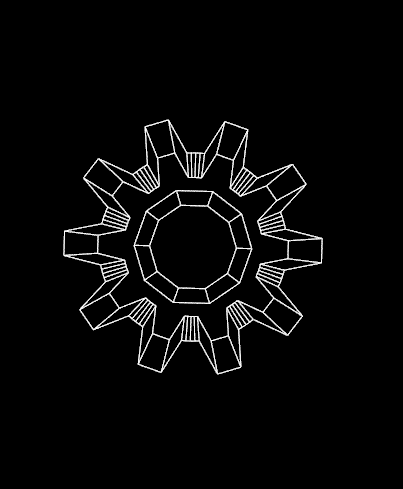
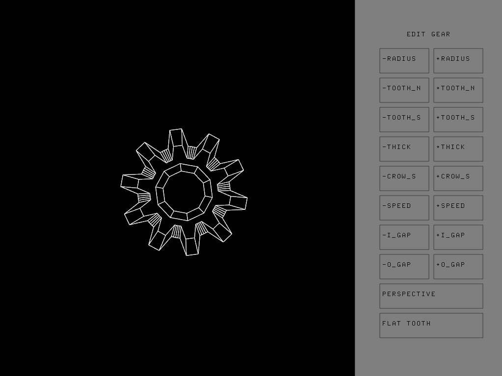

# Trabalho 4 - Geração de Engrenagens 3D

<h2>Descrição</h2>

Implemente um programa para fazer modelagem e visualização 3D de engrenagens em wireframe.

Vários tipos de engrenagens podem ser modelados:

- Dente com lado plano (Spur gear)
- Dente com lado curvado (Spur gear)
- Raios distintos (Spiral bevels)
- Dentes curvos (Helical gear)
- Durvos e raios distintos (Bevel gear)

Vários parâmetros podem ser definidos:

- Raios
- Número de dentes
- Angulação dos dentes
- Número de faces de cada dente

Requisitos básicos

- Modelagem de engrenagem tipo spur gear
- Animação (rotação)
- Visualização ortográfica e perspectiva (sob vários ângulos) em wireframe
- Parametrização do número de dentes e raios

Extras:

- [ ] Exibir vetores normais em cada face
- [x] Demais tipos de engrenagens
- [x] Edição livre de todos os parâmetros utilizados na engrenagem
- [x] Interface para edição da engrenagem
- [x] Rotação em diferentes ângulos com o mouse
- [x] Sistema de FPS
- [ ] Conectar duas engrenagens iguais com movimentação, com eixos conectados
- [ ] Preenchimento de polígonos com Iluminação por vértice
- [ ] Preenchimento de polígonos com Iluminação por pixel

<h2> Getting Started </h2>

Toda a utilização do programa é feita com o mouse e algumas teclas de atalho.

Para iniciar, compile o programa com a ferramenta CodeBlocks (Release 17.12). Recomenda-se que se edite os parâmetros uma vez que o programa seja iniciado, porém é possível inserir valores livres conforme as variáveis presentes no arquivos .h da [Câmera](src/Entities/Cam.h) e [Interface](src/Interface/Interface.h).

# Usabilidade

Ao iniciar o programa, o usuário poderá visualizar a engrenagem criada no meio da tela e a interface de edição no lado direito desta. Para se observar outros ângulos da engrenagem, deve segurar o botão esquerdo do mouse e arrastar conforme o desejo no eixo x ou y. Para alternar o sentido da rotação (vertical ou horizontal), basta pressionar uma vez a tecla `ctrl` e o sentido de rotação será alterado. Para voltar ao sentido anterior, basta pressionar a tecla novamente.

 
  

Com as seguintes teclas, serão alterados os parâmetros da **câmera** (a engrenagem permanecerá a mesma, o que será movido será a câmera):

- `w`: Aproximar a câmera do objeto
- `s`: Afastar a câmera do objeto
- `a`: Girar a câmera para a esquerda
- `d`: Girar a câmera para a direita
- `r`: Girar a câmera para cima
- `f`: Girar a câmera para baixo

 
  

# Interface

Nesta seção serão explicados cada um dos botões presentes no lado direito do programa, referentes a edição do parâmetros da engrenagem. Com exceção dos dois últimos botões, cada uma das opções terão duas configuração para o parâmetro, podendo adiciona-lo (+) ou diminuí-lo (-). Seguem os botões:

 
  

- `RADIUS`: Raio em relação ao centro da engrenagem até o círculo inferior (buraco da engrenagem)
- `TOOTH_N`: Número de dentes
- `TOOTH_S`: Tamanho de cada dente
- `THICK`: Espessura do objeto
- `CROW_S`: Tamanho da coroa da engrenagem (raio interior da engrenagem subtraído do raio exterior)
- `SPEED`: Velocidade de rotação da engrenagem (sentido horário ou anti horário)
- `I_GAP`: Distância de um dente até outro
- `O_GAP`: Tamanho da ponta de um dente à outra

As outas duas opções isoladas, alteram respectivamente:

- Estilo da visualização, entre ortográfica e perspectiva
- Estilo do dente da engrenagem, entre lado plano e curvado

O nome do botão será referente ao estilo da câmera ou engrenagem escolhida. Para alterar entre um valor e outro, basta pressionar o botão novamente.

# Exemplo

 
  

